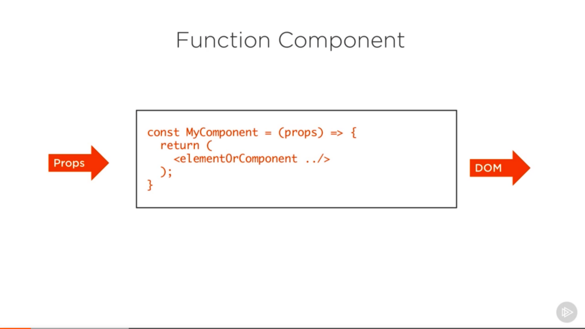
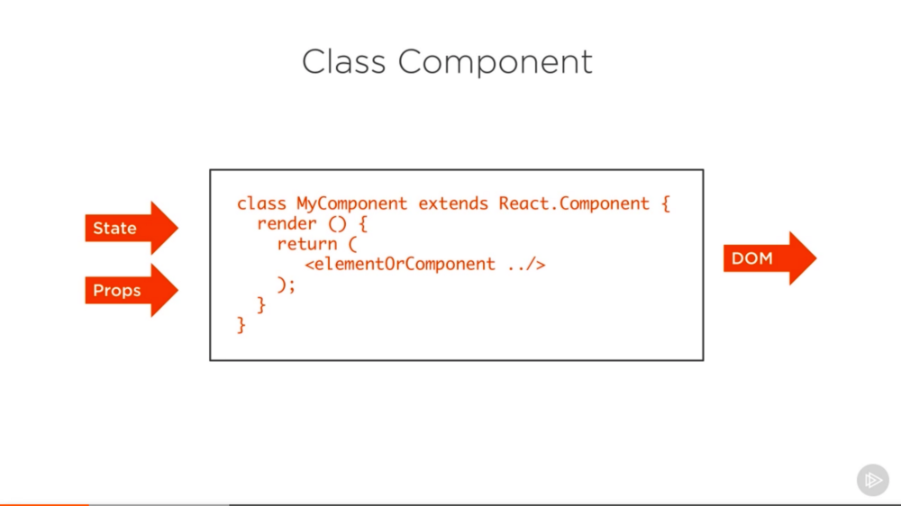
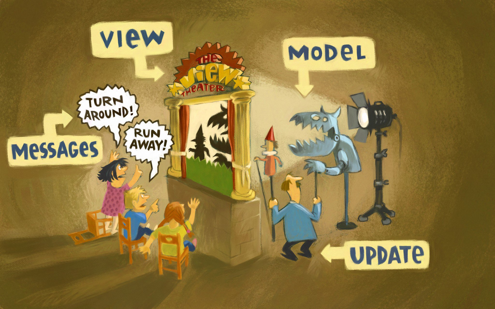
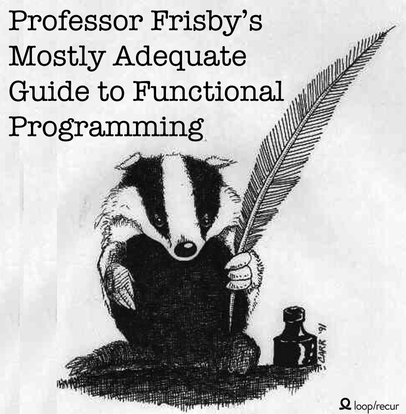

# React Workshop

---

## Agenda

* React
* Redux
* Build and Tooling
* Language
* Tests
* Styling
* Codebase

---

## React

+++

Why React?

+++

### View Library

* Renders into html element
* Different frameworks can be integrated
* [Hello Stack](https://andys8.github.io/hello-stack)

+++

### JSX

```jsx
const element = <h1 className="greeting">Hello, world!</h1>;
```

```js
const element = React.createElement(
  "h1",
  { className: "greeting" },
  "Hello, world!"
);
```

+++

### Functional Component



+++

* Functional stateless components
* Generic componets
* Reusability
* Avoid information leaks

+++

### Component (with state)



+++

* State vs Props
* Proptypes
* [Lifecycle](https://reactjs.org/docs/react-component.html)

+++

Talk: Smells In React Apps - JSConf.Asia 2018


+++

### Structure and Modularity

* Functional Components vs stateful or connected components
* Structure folders by feature not type e.g. reducers

---

## The Elm architecture

+++

+++

+++

+++


---

## Redux

* Alternative: Mobx
* Reducer
* Immutability:
  * `Object.assign`
  * Spread: `{...obj}`
  * Ramda

+++

### Redux Example

[Counter](https://codesandbox.io/s/github/reactjs/redux/tree/master/examples/counter)

+++

* Redux Saga
* Side effects
* Recompose

---

## Build

* Node
* NPM
* Webpack
* Dev server vs production build
* create-react-app

+++

### package.json

+++?code=src/example-package.json&lang=json
+++

## Static Code Analysis

* Eslint: Airbnb
* "Best Practices" for react

+++

## Code format

* Prettier
* Standard

+++

## Commit hook

Husky

---

## Javascript

+++

### ES6

* Babel
* import/export
* ES6 Syntax

+++

### Typescript

JS is valid typescript

---

## Editor

* VS Code
* IDEA
* Atom

+++

### Debug

* Chrome Extensions for React and Redux
* Debugger in browser or editor

+++

#### Demo Dev Tools

[Demo Redux Dev Tools](http://zalmoxisus.github.io/examples/todomvc/)

---

## Tests

+++

### Test Framework Jest


+++

### Test reducer

+++?code=src/reducer.test.js&lang=js
+++

#### Reducer Test Examples

<https://medium.com/@netxm/testing-redux-reducers-with-jest-6653abbfe3e1>
<https://redux.js.org/recipes/writing-tests>

+++

### Test view

Enzyme - [DEMO](http://airbnb.io/enzyme/)

Snapshot testing in jest

+++

### Test styles

React Storybook - [DEMO](https://storybook.js.org/examples/)

+++

### Integration Test

Puppeteer

Json-server

---

## Styling

* Sass
* Postcss

+++

### [BEM](http://getbem.com)

Block Element Modifier methodology

+++

### Styled components

+++?code=src/styled-components.jsx&lang=jsx

+++

* Flexbox
* CSS Grid
* Mediaqueries
* Responsive Webdesign

---

## Functional Programming

* [Ramda](http://ramdajs.com)
  * [Why Ramda](http://fr.umio.us/why-ramda/)
  * [Thinking Ramda](http://randycoulman.com/blog/categories/thinking-in-ramda)
* Lens
* Function Composition
* Currying and pointfree notation
  * [Why Curry Helps](https://hughfdjackson.com/javascript/why-curry-helps)

+++

### [Sanctuary](https://sanctuary.js.org)

* Maybe
* Either
* List
* Validation

+++

### Fantasyland


[Fantasyland Spec](https://github.com/fantasyland/fantasy-land)

+++

### Functional Programming in ES6

Jeremy Fairbank


+++

### Brian Lonsdorf / Dr. Boolean

[Professor Frisby Introduces Composable Functional JavaScript](https://egghead.io/courses/professor-frisby-introduces-composable-functional-javascript)

+++



---

## Information

* Documentation: React, Redux
* Egghead: [React/Redux](https://egghead.io/courses/getting-started-with-redux)
* Talks JSConf, ReactConf, ReactEurope
* Meetups: JS, JS the language, Frontend
* Newsletter: Javascript Weekly, React Status, Frontend Focus
* Twitter

---

## Codebase Walkthrough

* [TODO List](https://codesandbox.io/s/github/reactjs/redux/tree/master/examples/todos)
* [Realworld.io](https://stackblitz.com/edit/react-redux-realworld)
