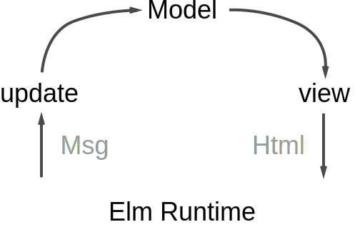

# React Workshop

---

## Agenda

* React
* Redux
* Build and Tooling
* Language
* Tests
* Styling
* Codebase

---

## React

* Create react app
* View Library
* Renders into html element
  * Different frameworks can be integrated
  * Hello Stack

+++

## JSX

+++

## Lifecycle

<https://reactjs.org/docs/react-component.html>

+++

## State

State vs Props

PropTypes

+++

* Functional stateless components
* Generic componets
* Reusability
* Avoid information leaks
* [Talk: Smells In React Apps - JSConf.Asia 2018](https://www.youtube.com/watch?v=xBa0_b-5XDw)

+++

### Structure and Modularity

* Functional Components vs stateful or connected components
* Structure folders by feature not type e.g. reducers

---

## The Elm architecture

+++

+++

+++

---

## Redux

* Reducer
* Immutability
* Alternative: Mobx

+++

* Redux Saga
* Side effects

+++

Recompose

+++

### Example

[Counter](https://codesandbox.io/s/github/reactjs/redux/tree/master/examples/counter)

---

## Build

* Node
* NPM
* Webpack
* Dev-Server vs production build

+++

## Static Code Analysis

* Eslint: Airbnb
* "Best Practices" for react

+++

## Code format

* Prettier
* Standard

+++

## Commit hook

Husky

---

## Javascript

+++

### ES6

* Babel
* import/export
* ES6 Syntax

+++

### Typescript

JS is valid typescript

+++

### Functional Programming

* Currying Pointfree
* Ramda
* Maybe / Option
* Lens
* Validation monad
* Fantasyland Spec

+++

#### Brian Lonsdorf / Dr. Boolean

<https://egghead.io/courses/professor-frisby-introduces-composable-functional-javascript>

+++

---

## Editor

* VS Code
* IDEA
* Atom

+++

### Debug

* Chrome Extensions for React and Redux
* Debugger in browser or editor

+++

#### Demo Dev Tools

[Demo Redux Dev Tools](http://zalmoxisus.github.io/examples/todomvc/)

---

## Tests

+++

### Test JS

* Jest
* Test watcher
* vscode plugin demo

+++

### Test view

Enzyme: Do not mount

+++

### Test reducer

+++

### Test styles

React Storybook

+++

### Integration Test

* Puppeteer
* Json-server

---

## Styling

* Sass
* Postcss
* BEM

+++

### Styled components

+++

* Flexbox
* CSS Grid
* Mediaqueries
* Responsive Webdesign

---

## Information

* Documentation: React, Redux
* Egghead: [React/Redux](https://egghead.io/courses/getting-started-with-redux)
* Talks JSConf, ReactConf, ReactEurope
* Meetups: JS, JS the language, Frontend
* Newsletter: Javascript Weekly, React Status, Frontend Focus
* Twitter

---

## Codebase Walkthrough

* [TODO List](https://codesandbox.io/s/github/reactjs/redux/tree/master/examples/todos)
* [Realworld.io](https://stackblitz.com/edit/react-redux-realworld)