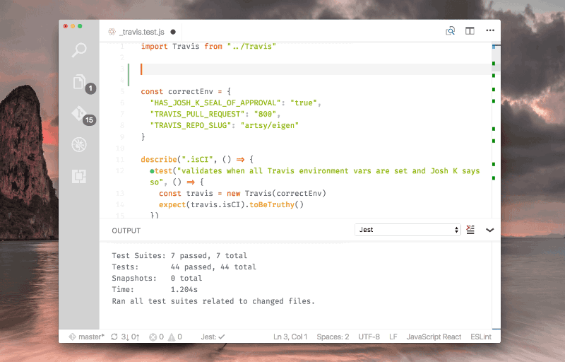

# React Workshop

---

## Agenda

* React
* Redux
* Build and Tooling
* Language
* Tests
* Styling
* Codebase

---

## React

+++

Why React?

+++

### View Library

* Renders into html element
* Different frameworks can be integrated
* Hello Stack

+++

### JSX

```jsx
const element = (
  <h1 className="greeting">
    Hello, world!
  </h1>
);
```

```js
const element = React.createElement(
  'h1',
  {className: 'greeting'},
  'Hello, world!'
);
```

+++

### Functional Component


+++

* Functional stateless components
* Generic componets
* Reusability
* Avoid information leaks

### Component (with state)


+++

* state vs props
* proptypes
* Lifecycle: <https://reactjs.org/docs/react-component.html>


+++

Talk: Smells In React Apps - JSConf.Asia 2018


+++

### Structure and Modularity

* Functional Components vs stateful or connected components
* Structure folders by feature not type e.g. reducers

---

## The Elm architecture

+++

+++

+++


---

## Redux

* Alternative: Mobx
* Reducer
* Immutability:
  * `Object.assign`
  * Spread: `{...obj}`
  * Ramda

+++

### Example

[Counter](https://codesandbox.io/s/github/reactjs/redux/tree/master/examples/counter)

+++

* Redux Saga
* Side effects
* Recompose

---

## Build

* Node
* NPM
* Webpack
* Dev server vs production build
* create-react-app

+++

### package.json

+++?code=src/example-package.json&lang=json

## Static Code Analysis

* Eslint: Airbnb
* "Best Practices" for react

+++

## Code format

* Prettier
* Standard

+++

## Commit hook

Husky

---

## Javascript

+++

### ES6

* Babel
* import/export
* ES6 Syntax

+++

### Typescript

JS is valid typescript

---

## Editor

* VS Code
* IDEA
* Atom

+++

### Debug

* Chrome Extensions for React and Redux
* Debugger in browser or editor

+++

#### Demo Dev Tools

[Demo Redux Dev Tools](http://zalmoxisus.github.io/examples/todomvc/)

---

## Tests

+++

### Test JS

Jest



+++

### Test reducer

+++?code=src/reducer.test.js&lang=js

<https://medium.com/@netxm/testing-redux-reducers-with-jest-6653abbfe3e1>

+++

<https://redux.js.org/recipes/writing-tests>

+++

### Test view

Enzyme - [DEMO](http://airbnb.io/enzyme/)

Snapshot testing in jest

+++

### Test styles

React Storybook - [DEMO](https://storybook.js.org/examples/)

+++

### Integration Test

* Puppeteer
* Json-server

---

## Styling

* Sass
* Postcss
* BEM

+++

### Styled components

+++

* Flexbox
* CSS Grid
* Mediaqueries
* Responsive Webdesign

---

## Functional Programming

* Ramda
* Currying and Pointfree notation
* Maybe / Option
* Lens
* Validation monad
* Fantasyland Spec

+++

### Jeremy Fairbank - Functional Programming Basics in ES6


+++

### Brian Lonsdorf / Dr. Boolean

<https://egghead.io/courses/professor-frisby-introduces-composable-functional-javascript>

+++


---

## Information

* Documentation: React, Redux
* Egghead: [React/Redux](https://egghead.io/courses/getting-started-with-redux)
* Talks JSConf, ReactConf, ReactEurope
* Meetups: JS, JS the language, Frontend
* Newsletter: Javascript Weekly, React Status, Frontend Focus
* Twitter

---

## Codebase Walkthrough

* [TODO List](https://codesandbox.io/s/github/reactjs/redux/tree/master/examples/todos)
* [Realworld.io](https://stackblitz.com/edit/react-redux-realworld)